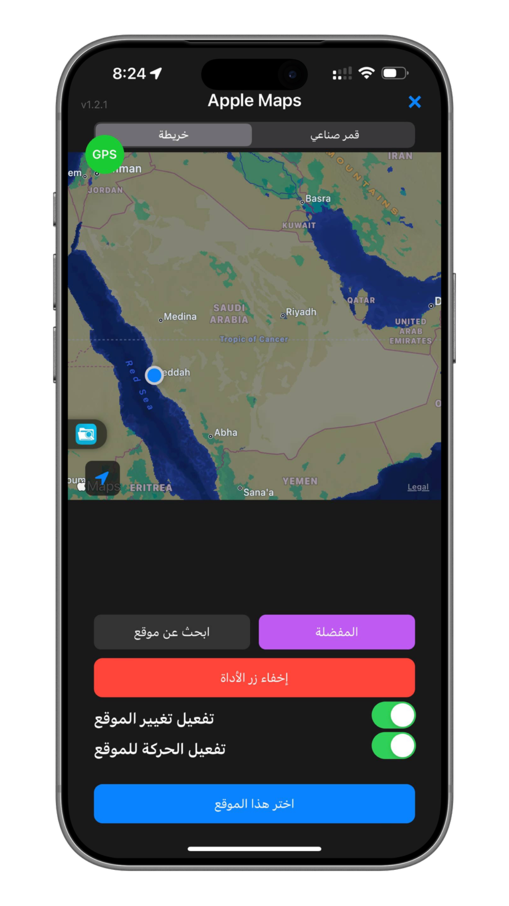

# Fox1 — WolFox

**نطاق العمل: الموقع والحركة.**

[خطة العمل والمحتوى](FOX_PLAN_AR.md) · [الصورة الأصلية](design/reference.png)

هذا فرع تخطيط مستقل مشتق من main. الصورة والخطة موثقتان؛ تنفيذ الواجهة والبناء الخاص بهذا التصميم ضمن مراحل الخطة ولم يكتمل بعد.

Fox1: الموقع والحركة. Fox2: الموقع وBluetooth وBeacons. Fox3: الموقع ورفع الصور ومعرّف الجهاز.

اسم المنتج داخل التطبيق يبقى WolFox.
